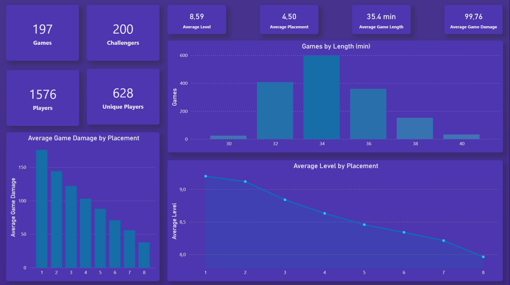
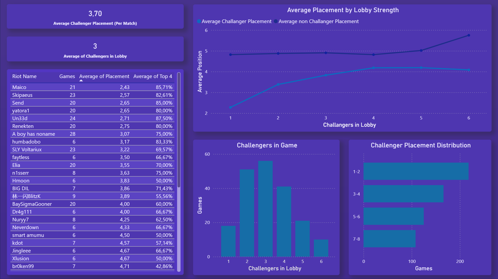
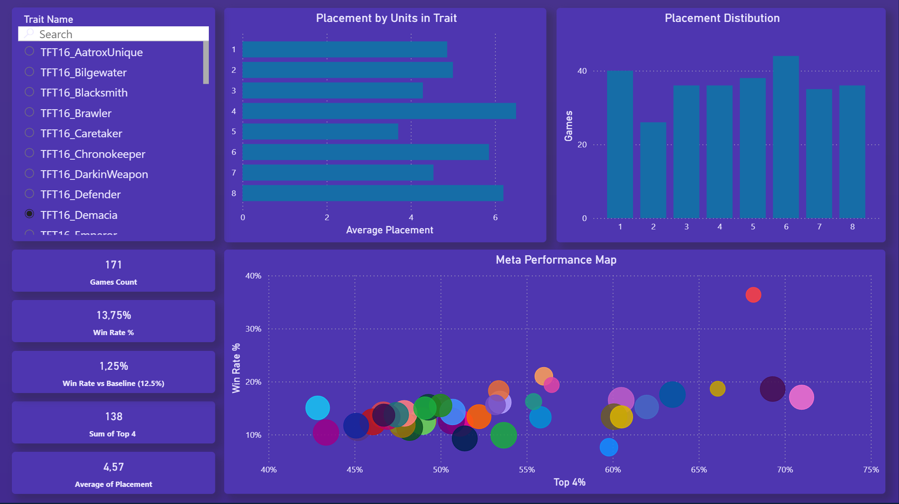

# Teamfight Tactics Data Analytics

A personal data analytics project based on real Teamfight Tactics match data collected from the Riot Games API.

The project covers the complete data analysis workflow — from collecting and storing raw data, through SQL transformation and data modeling, to building an interactive Power BI dashboard.

## Project Overview

The main goal of this project was to analyze high-level Teamfight Tactics matches from the EUW server and explore player performance, lobby strength and the effectiveness of different traits and synergies.

The analysis is based on approximately 200 matches and more than 1,500 player records.

The project focuses on three main areas:

- **Lobby Strength** – comparison of player performance using metrics such as average placement, Top 4 rate and number of games.
- **Trait & Synergy Analysis** – analysis of the popularity and effectiveness of different TFT traits.
- **Challenger Leaderboard** – comparison of players from the EUW Challenger ladder.


## Technologies & Tools

- **Python** – collecting data from the Riot Games API and loading it into the MySQL database
- **Riot Games API** – source of Challenger player and match data
- **MySQL** – storage of collected match, player and trait data
- **SQL** – data transformation, joins, aggregations and creation of analytical views
- **Power Query** – data preparation before loading data into the report
- **Power BI** – data modeling, visualization and dashboard development
- **DAX** – creation of measures and calculated metrics used in the analysis

 ## Data Pipeline

The project follows an end-to-end data workflow:

**Riot Games API → Python → MySQL → SQL → Power BI → DAX → Dashboard**

1. Match and Challenger player data was retrieved from the **Riot Games API** using Python.
2. Python scripts processed the API responses and loaded the collected data into a **MySQL database**.
3. **SQL** was used to join tables, aggregate data and create views prepared for analysis.
4. The prepared data was loaded into **Power BI**, where additional transformations and data modeling were performed.
5. **DAX measures** were created to calculate analytical metrics such as Average Placement, Top 4 Rate and Games Played.
6. The final results were presented in an interactive **Power BI dashboard**.

## Data Collection & Database

Match and Challenger data was collected from the Riot Games API using Python and stored in a MySQL database.

The main tables used in the project were:

- `tft_challenger_euw` – Challenger player data
- `tft_matchlist_euw` – match IDs assigned to collected players
- `tft_match_participants_euw` – participant-level match statistics
- `tft_match_traits_euw` – traits used by individual players in each match

The database was designed to keep match, player and trait data separate, while allowing them to be joined using `match_id` and `puuid`.

## SQL Analysis & Data Preparation

SQL was used to explore the collected data, calculate analytical metrics and prepare datasets for Power BI.

The analysis included:

- calculating dashboard KPIs,
- player-level performance analysis,
- Top 4 and win rate calculations using `CASE WHEN`,
- filtering players by minimum number of matches using `HAVING`,
- comparing Challenger and non-Challenger players,
- lobby-level analysis using joins and aggregations,
- data quality checks,
- creation of analytical SQL views used later in Power BI.

Several views were created to simplify the reporting layer:

- `vw_tft_participants_enriched`
- `vw_tft_match_summary`
- `vw_tft_player_traits_enriched`
- `vw_traits_analysis`

The SQL scripts used in the project are available in the `sql/` directory.

## Power BI Dashboard

The final Power BI report consists of three analytical pages designed to explore the dataset from different perspectives.

### 1. Match Overview

The first page provides a high-level overview of the collected TFT match data.

It includes key metrics such as the number of analyzed games, player records, unique players, average placement, average game length, average player level and average damage dealt to other players.

The visualizations also show how player level and damage change depending on final placement, as well as the distribution of game duration.



### 2. Challenger & Lobby Analysis

The second page focuses on Challenger players and lobby strength.

It compares individual Challenger performance using metrics such as games played, average placement and Top 4 rate. The dashboard also analyzes how the number of Challenger players in a lobby relates to their average placement and compares Challenger performance with non-Challenger players.

Additional visualizations show the distribution of Challenger placements and the number of matches grouped by Challenger presence in the lobby.



### 3. Trait & Synergy Analysis

The third page focuses on TFT traits and their effectiveness.

An interactive trait selector allows individual traits to be analyzed using metrics such as games played, win rate, Top 4 performance and average placement.

The page also shows how the number of units activating a trait relates to average placement and includes a performance map for comparing traits based on Top 4 rate and win rate.



## DAX Measures

DAX measures were used to calculate dynamic metrics that respond to filters and slicers in the Power BI report.

Examples include:

- **Top 4 Rate** – percentage of player results finishing in positions 1–4
- **Average Placement Challenger** – average placement calculated only for Challenger players
- **Average Game Length** – conversion of raw game duration into a readable value in minutes

The measures demonstrate the use of filtering context, `CALCULATE`, `DIVIDE`, `COUNTROWS` and aggregation functions in Power BI.

Selected DAX measures are available in the `dax/` directory.

## Key Insights

The dashboard provides several insights into player performance, lobby strength and trait effectiveness.

### Match & Player Performance

- The dataset contains **197 matches and 1,576 participant records**, representing **628 unique players**.
- The overall average placement is **4.50**, which is consistent with the expected midpoint of an eight-player TFT lobby.
- Player performance shows a clear relationship with both **level and damage dealt**. Players finishing in higher positions generally reached higher levels and dealt significantly more damage to other players.
- First-place players dealt the highest average damage, while average damage gradually decreased toward lower placements.
- A similar pattern can be observed for player level: players finishing near the top of the lobby generally reached higher levels than players eliminated earlier.
- The average analyzed match lasted approximately **35.4 minutes**, with most matches concentrated around the middle of the observed game-length distribution.

### Challenger & Lobby Analysis

- Challenger players achieved an average placement of approximately **3.70**, indicating stronger-than-average performance within the analyzed matches.
- Individual Challenger performance varied considerably. Some players achieved average placements below 3.0 and Top 4 rates above 80%, while others performed much closer to the overall lobby average.
- Most analyzed matches contained between **2 and 4 Challenger players**, with approximately three Challengers appearing in a lobby on average.
- Challenger players generally maintained better average placements than non-Challenger players across different lobby-strength levels.
- The difference between Challenger and non-Challenger performance was particularly visible in lobbies containing fewer Challenger players.
- As the number of Challenger players in a lobby increased, their average placement moved closer to the middle of the ranking. This suggests that stronger competition between high-ranked players may reduce the advantage of an individual Challenger player.

### Trait & Synergy Analysis

- Trait effectiveness varied considerably across the analyzed dataset, showing that frequently played traits were not necessarily the most successful ones.
- The interactive trait selector allows each trait to be evaluated independently using **games played, win rate, Top 4 rate and average placement**.
- The number of units activating a trait was also associated with different placement outcomes, allowing different activation levels to be compared.
- The **Meta Performance Map** combines Top 4 rate and win rate, making it possible to identify traits that performed above or below the general population.
- A baseline win rate of **12.5%** was used as a natural reference point because each TFT lobby contains eight players and only one player can finish first.
- Traits with both a high Top 4 rate and a high win rate can be considered stronger-performing options in the analyzed sample, while traits with high usage but weaker results may indicate popularity without equivalent effectiveness.

### Overall Conclusion

The analysis suggests that successful TFT performance is associated with stronger in-game development, particularly higher player levels and greater damage dealt. Challenger players generally outperform the wider player population, although their advantage becomes smaller in stronger lobbies containing more high-ranked players.

The trait analysis also shows that popularity alone is not a sufficient indicator of effectiveness. Combining usage, Top 4 rate, win rate and average placement provides a more complete view of trait performance than relying on a single metric.

## Repository Structure

```text
TFT-data-analytics/
├── dax/
│   └── measures.dax
├── images/
│   ├── 01_overview.png
│   ├── 02_lobby_analysis.png
│   └── 03_traits_analysis.png
├── powerbi/
│   └── tft_project.pbix
├── sql/
│   ├── 01_database_schema.sql
│   ├── 02_overview_analysis.sql
│   ├── 03_player_analysis.sql
│   └── 04_analytical_views.sql
└── README.md
```
